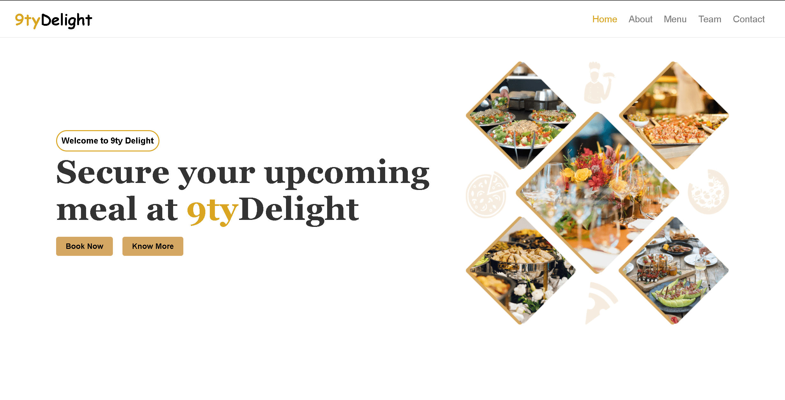
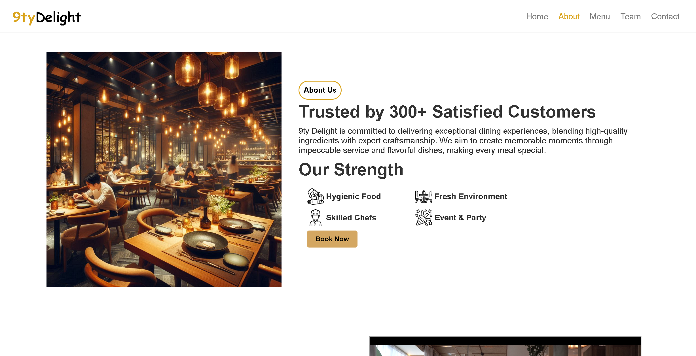
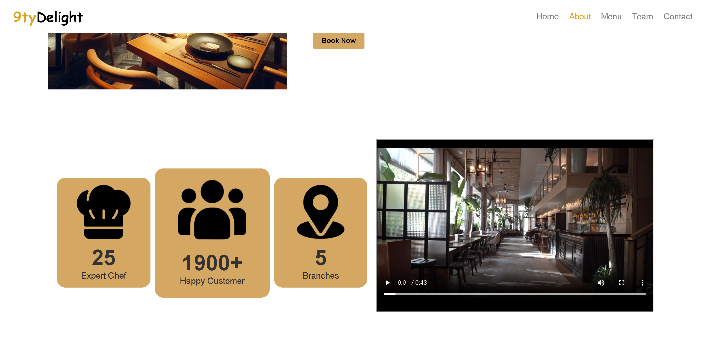
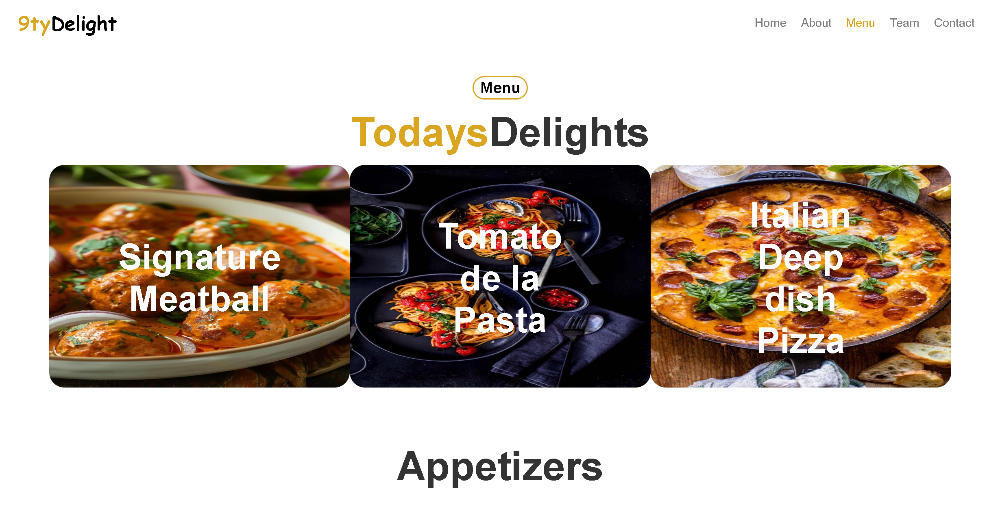
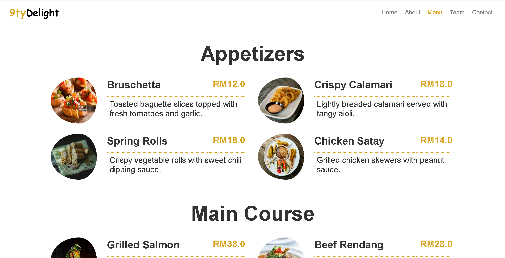
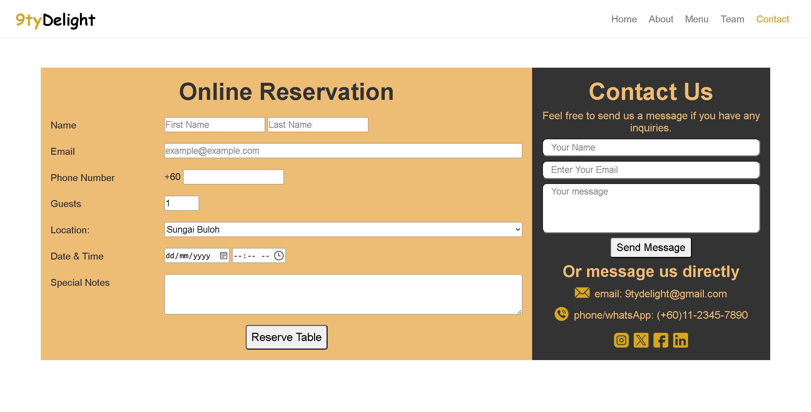
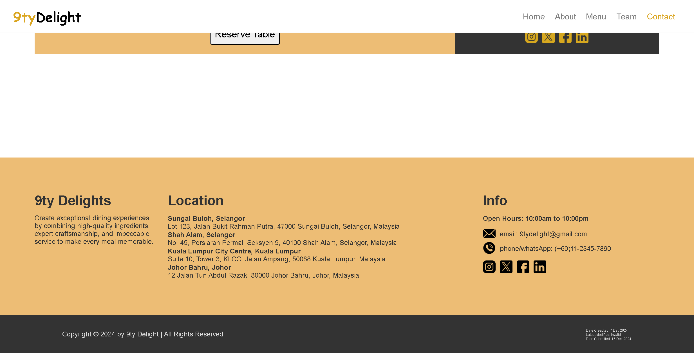
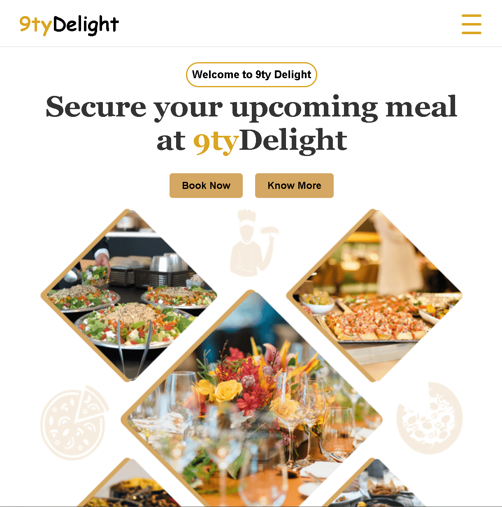
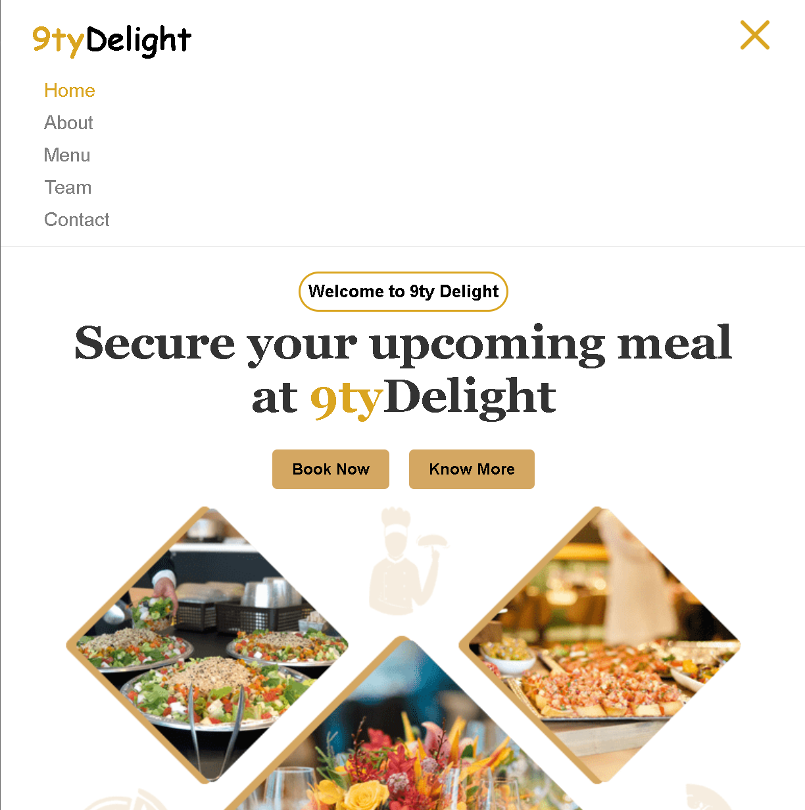
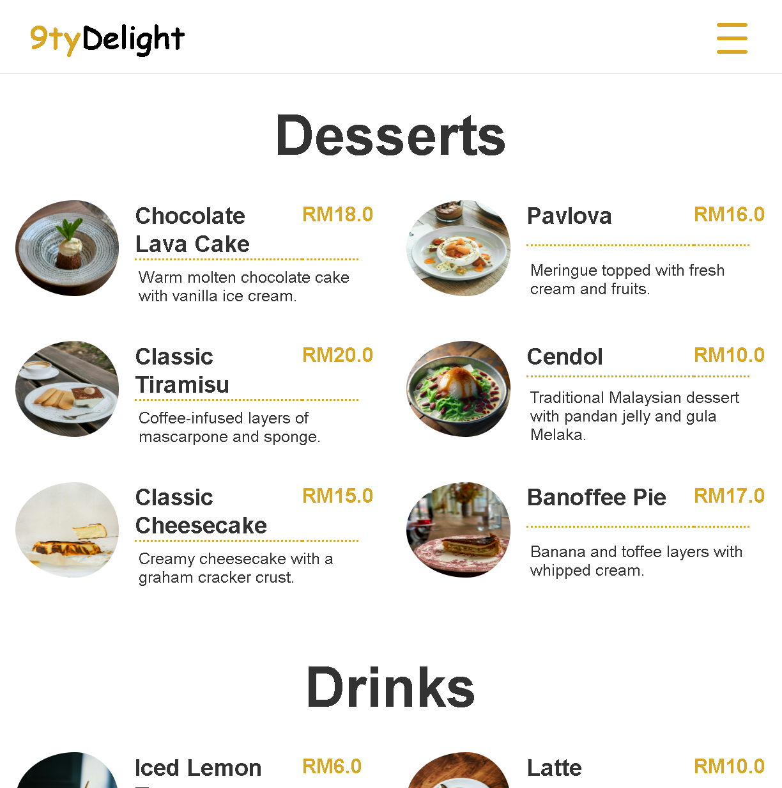

# 🍽️ 9ty Delight – Restaurant Website

Welcome to **9ty Delight**, a modern and fully responsive restaurant website built to showcase an elegant dining experience. This fictional project highlights user-centered design, interactivity, and responsiveness.

---

## ✨ Key Features

- **Sticky Navigation** with smooth scroll and active section highlighting  
- **Hero Section** with call-to-action buttons  
- **About Us** section with video, testimonials, and restaurant stats  
- **Dynamic Menu** categorized into Appetizers, Mains, Desserts, and Drinks  
- **Team Showcase** introducing the developers  
- **Reservation Form** with real-time date/time validation  
- **Contact Form** with social links and direct contact info  
- **Custom Modal Alerts** for clean feedback  
- **Login & Signup Pages** with validation and redirection  
- **Responsive Footer** with branch info and hours  

---

## 📱 Responsive Design

Built with a mobile-first approach using **Flexbox**, **CSS Grid**, and **media queries**. Key responsive features include:

- Hamburger navigation on smaller screens  
- Scalable, fluid layouts  
- Images that resize gracefully  
- Forms that adapt across devices  

---

## 🛠️ Tech Stack

- **HTML5** – Semantic layout and accessible forms  
- **CSS3** – Styling, animations, responsive design  
- **JavaScript** – DOM manipulation, validation, dynamic behaviors  

---

## 📸 Screenshots

> Showcase of key sections from the 9ty Delight website:

### 🏠 Home

### 🧾 About

### 📊 Statistics

### 🍽️ Menu

### 🧆 Menu Items

### 📝 Twin Forms

### 📞 Footer

### 📱 Mobile View

### 📋 Mobile Navbar

### 📲 Mobile View 2

---

## 👨‍💻 Team & Contributions

This project demonstrates front-end development skills including:

- Responsive UI/UX design  
- JavaScript interactivity & validation  
- Custom form logic and alerts  

---

## 💡 Use Case

An ideal layout for restaurants wanting a beautiful online presence with booking and contact functionality.

> **Note:** This is a project for my Web Fundamental course in Sunway University.

---
